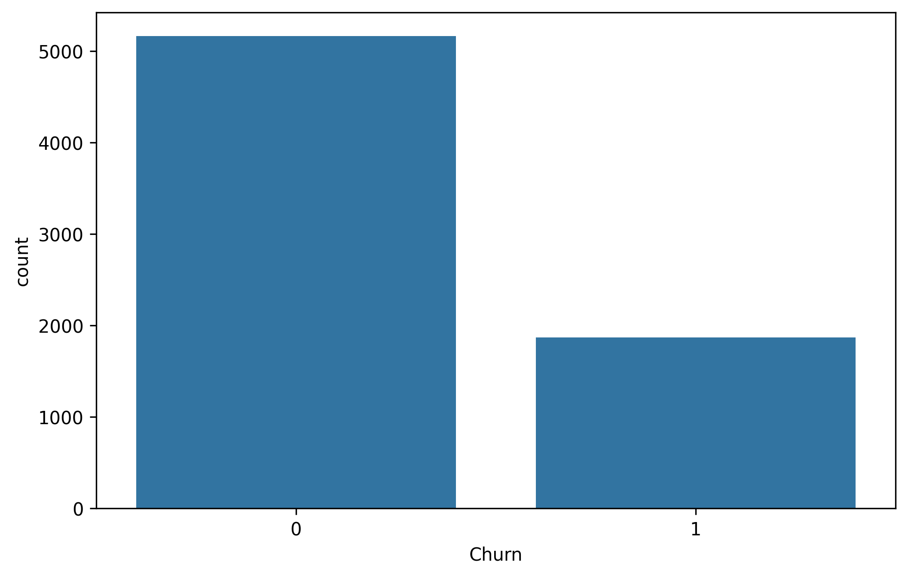
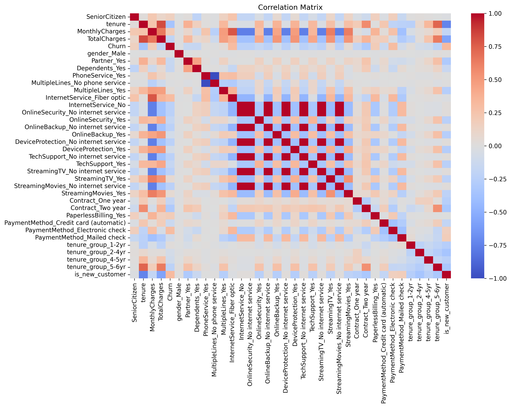
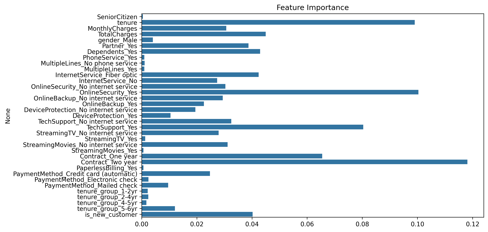
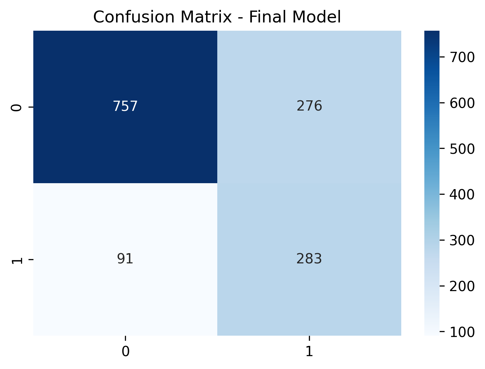

# 📊 Telco Customer Churn Prediction

## 📌 Project Overview

Customer churn prediction is critical for subscription-based companies. This project aims to identify customers likely to churn using machine learning techniques and provide actionable business insights.

---

## 🎯 Business Objective

Predict customers likely to churn and identify key drivers of customer attrition.

---

## 📊 Dataset

Telco Customer Churn Dataset

- 7043 customers
- 21 features
- Binary classification problem

---

## 🧠 Methodology

This project follows CRISP-DM methodology:

- Business Understanding
- Data Understanding
- Data Preparation
- Modeling
- Evaluation

---

## 📊 Churn Distribution

The dataset shows class imbalance, which motivated the use of SMOTE.

---

## 🔍 Correlation Matrix

Key insights:

- Customers with longer tenure churn less
- Long-term contracts reduce churn
- Higher monthly charges increase churn
- Customers with tech support churn less

---

## 🤖 Models Used

- Logistic Regression (Baseline)
- Random Forest
- Random Forest + SMOTE
- Random Forest + Hyperparameter Tuning

---

## 📈 Feature Importance

Top drivers of churn:

- Tenure
- Contract type
- Monthly charges
- Tech support
- Online security

---

## 🎯 Model Performance

The model prioritizes identifying customers at risk of churn, even if some false positives occur. This approach is useful for retention strategies.

---

## 💡 Business Recommendations

Based on model insights:

- Focus retention strategies on new customers
- Promote long-term contracts
- Offer technical support packages
- Review pricing for high monthly charge customers
- Identify high-risk customers early
- Implement proactive retention campaigns

---

## 🛠 Technologies Used

- Python
- Pandas
- Numpy
- Scikit-learn
- Matplotlib
- Seaborn
- SMOTE

---

## 📁 Project Structure

# 📊 Telco Customer Churn Prediction

## 📌 Project Overview

Customer churn prediction is critical for subscription-based companies. This project aims to identify customers likely to churn using machine learning techniques and provide actionable business insights.

---

## 🎯 Business Objective

Predict customers likely to churn and identify key drivers of customer attrition.

---

## 📊 Dataset

Telco Customer Churn Dataset

- 7043 customers
- 21 features
- Binary classification problem

---

## 🧠 Methodology

This project follows CRISP-DM methodology:

- Business Understanding
- Data Understanding
- Data Preparation
- Modeling
- Evaluation

---

## 📊 Churn Distribution

The dataset shows class imbalance, which motivated the use of SMOTE.

---

## 🔍 Correlation Matrix

Key insights:

- Customers with longer tenure churn less
- Long-term contracts reduce churn
- Higher monthly charges increase churn
- Customers with tech support churn less

---

## 🤖 Models Used

- Logistic Regression (Baseline)
- Random Forest
- Random Forest + SMOTE
- Random Forest + Hyperparameter Tuning

---

## 📈 Feature Importance

Top drivers of churn:

- Tenure
- Contract type
- Monthly charges
- Tech support
- Online security

---

## 🎯 Model Performance

The model prioritizes identifying customers at risk of churn, even if some false positives occur. This approach is useful for retention strategies.

---

## 💡 Business Recommendations

Based on model insights:

- Focus retention strategies on new customers
- Promote long-term contracts
- Offer technical support packages
- Review pricing for high monthly charge customers
- Identify high-risk customers early
- Implement proactive retention campaigns

---

## 🛠 Technologies Used

- Python
- Pandas
- Numpy
- Scikit-learn
- Matplotlib
- Seaborn
- SMOTE

---

## 📁 Project Structure

telco-churn-prediction
│
├── notebook
├── data
├── images
├── README.md
└── requirements.txt

---

## 🚀 Business Impact

This model helps companies:

- Reduce churn
- Increase customer retention
- Improve revenue
- Identify at-risk customers

---

## 👩‍💻 Author

Leidy Jaramillo  
Data Science Project
